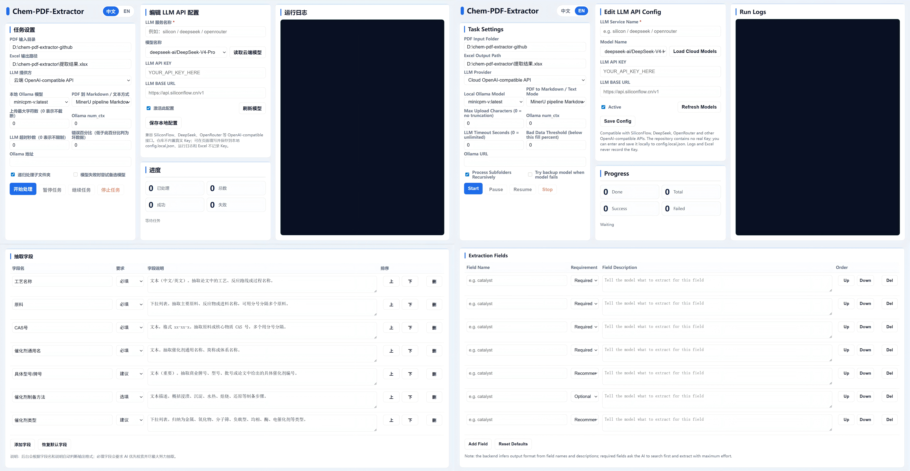
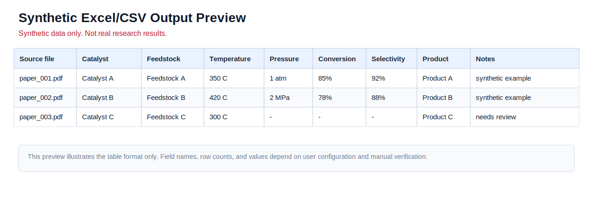

# Chem-PDF-Extractor

Chem-PDF-Extractor is an open-source tool for extracting structured experimental data from chemical engineering, catalysis, materials, energy, and environmental research PDFs into Excel/CSV tables. It is designed for literature reviews, preliminary dataset construction, and manual verification workflows.

Chem-PDF-Extractor 是一个面向化工、催化、材料、能源与环境领域论文的开源 PDF 数据抽取工具，可将文献中的实验条件和结果整理为 Excel/CSV 表格，适用于文献综述、初步数据集构建和后续人工核验流程。

**Language / 语言:** [English](#english) | [中文](#chinese)

<a id="english"></a>

## Overview

The project provides an inspectable, local-first workflow for converting PDF papers to Markdown/text, defining configurable LLM-based extraction fields, extracting multiple records from one paper, and exporting structured results for review. It supports local Ollama models and optional OpenAI-compatible cloud APIs, but cloud use is opt-in and requires the user to provide their own API configuration.

The output is intended as first-pass extraction for literature review and dataset preparation. It should be checked against the original paper before being used for scientific conclusions.

## Why This Project

Experimental information in scientific papers is often scattered across paragraphs, tables, figures, captions, and supplementary materials. Manually collecting feedstocks, catalysts, reaction temperature, pressure, conversion, selectivity, yield, and product information is slow and error-prone. This project provides a local, inspectable workflow for building first-pass structured datasets that still require human review.

## Workflow Overview

1. Install the project and start the local Web UI or CLI.
2. Choose a PDF mode: `pymupdf4llm` for the recommended default, `pypdf_text` for the smallest fallback, `auto` for the current heuristic path, or optional `mineru` for harder layouts.
3. Choose a field template from [Field Templates](examples/field_templates/README.md) or provide a custom `fields.json`.
4. Run extraction with local Ollama or an OpenAI-compatible cloud provider.
5. Review extracted rows, warnings, bad-row filtering, and evidence/hint columns against the source PDF.
6. Export Excel/CSV results for downstream manual review.

## Supported Workflows

- Local Web UI: run `python -m chem_pdf_extractor`, open the printed `127.0.0.1` URL, configure fields and models, then start a batch.
- Local LLM: use Ollama when you want PDF text and prompts to stay on the machine running the tool.
- Optional cloud LLM: use an OpenAI-compatible Base URL, model name, and API key when you intentionally choose a cloud provider.
- CLI: use `python -m chem_pdf_extractor --cli ...` for scripted local runs.

## Features

- Batch PDF processing.
- PDF to Markdown/text conversion.
- Configurable LLM-based extraction fields.
- Multiple records from one paper written as multiple rows.
- Excel and CSV output.
- Review/provenance aid output columns (`source_evidence`, `source_hint`, `verification_status`, `review_note`, `page_hint`, `section_hint`, and `table_hint`) help users prioritize manual verification. They are optional hints, not guaranteed full provenance, PDF highlighting, page-coordinate anchors, or statistical confidence scores.
- Low-fill-rate bad row filtering.
- Error logs, suspicious-data records, and bad-data records.
- Pause, resume, stop, and resumable processing.
- Reuse of `md文件/` and `抽取缓存/`.
- OpenAI-compatible API support.
- Cloud structured-output validation normalizes unexpected provider responses safely, but it does not prove scientific accuracy.
- Local Ollama model support.

## Quick Start

```powershell
git clone https://github.com/myklovenyzforever/chem-pdf-extractor.git
cd chem-pdf-extractor
python -m venv .venv
.\.venv\Scripts\activate
python -m pip install -r requirements.txt
python -m chem_pdf_extractor
```

By default, the program prints the local Web UI URL in the terminal and does not open the browser automatically. Copy the printed URL into your browser, select a PDF folder, configure extraction fields, and start processing. Test with 3-5 PDFs before running a large batch.

If you want the program to open the browser automatically, run:

```powershell
python -m chem_pdf_extractor --open-browser
```

If `pymupdf4llm` / `pymupdf` fails to install or import on Windows + Python 3.12, use the core dependency fallback:

```powershell
python -m pip install -r requirements-core.txt
python -m chem_pdf_extractor --cli --pdf-mode pypdf_text
```

Alternative script entry:

```powershell
python run_chem_pdf_extractor.py
```

When installed from a built wheel, the `chem-pdf-extractor` console script is also available. The module entry point remains the recommended way to run the project from a source checkout.

Maintainers who are verifying a release can install with `constraints.txt` to avoid unreviewed major dependency jumps:

```powershell
python -m pip install -r requirements.txt -c constraints.txt
```

Normal source users can continue using `requirements.txt` or `requirements-core.txt` directly. See [Windows One-click Package Guide](docs/windows_package.md) for package and release-constraint guidance.

## Web UI Workflow

1. Start with `python -m chem_pdf_extractor`.
2. Open the local URL printed in the terminal.
3. Select the PDF input folder and output path.
4. Choose PDF mode, max text budget, model provider, and model settings.
5. Apply a field template or edit fields below the first workbench.
6. Start the task, watch progress/logs, then inspect exported Excel/CSV files and review-aid columns.

The compact three-column workbench is documented in [UI Layout Contract](docs/ui_layout_contract.md). The field editing panel intentionally stays below the first workbench.

## CLI Workflow

Use CLI mode when you want a repeatable command or do not need the browser UI:

```powershell
python -m chem_pdf_extractor --cli --input-dir .\papers --output .\output\results.xlsx --pdf-mode pymupdf4llm --llm-provider ollama --model qwen2.5:7b
```

For cloud providers, pass or save a real API key, Base URL, and model name. Do not put private keys into committed scripts, issue reports, screenshots, or logs.

For CLI cloud runs, prefer environment variables:

```powershell
$env:CHEM_PDF_EXTRACTOR_API_KEY="YOUR_API_KEY_HERE"
$env:CHEM_PDF_EXTRACTOR_BASE_URL="https://api.example.com/v1"
$env:CHEM_PDF_EXTRACTOR_MODEL="provider/model-name"
python -m chem_pdf_extractor --cli --llm-provider cloud
```

Use `--llm-provider ollama` when you want to stay local.

## Configuration

This repository does not include any real API key, token, or password.

Normal users can enter the API key in the web interface. The configuration can be saved to `config.local.json`, which is ignored by Git. `config.example.json` is only a template and contains placeholders.

Users can enter an OpenAI-compatible Base URL and API key, then use "Fetch models" to load available model IDs when the provider supports the `/models` endpoint. If model discovery is unavailable, users can still enter the model name manually.

Cloud extraction requires a real API key, Base URL, and model name. Placeholder values are rejected before a task starts.

Environment variables are supported for advanced users, but they are optional and not required for normal use.

```powershell
$env:CHEM_PDF_EXTRACTOR_API_KEY="YOUR_API_KEY_HERE"
$env:CHEM_PDF_EXTRACTOR_BASE_URL="https://api.example.com/v1"
$env:CHEM_PDF_EXTRACTOR_MODEL="provider/model-name"
```

## Local Security Notes

- The Web UI is intended for local use on `127.0.0.1` / `localhost`. Do not expose it to a LAN, public server, or shared remote environment.
- Cloud API keys should be treated as secrets. The local config API reports only whether a key exists and does not return the full key.
- Cloud Base URLs are checked before API keys are sent. Use HTTPS for cloud providers; plain HTTP is accepted only for localhost.
- Excel and CSV exports sanitize formula-like cell values to reduce spreadsheet formula-injection risk.
- Failed source PDF copying is disabled by default. Enable it only when debugging, because it may duplicate private, copyrighted, unpublished, or confidential PDFs.
- Logs and diagnostics redact common API key, token, bearer-token, password, and secret patterns, but users should still review files before sharing them publicly.

## One-click Windows Package

The GitHub source repository does not include `bundled_runtime/` or `YiLaiHuanJing/`. A bundled Windows package may be provided through GitHub Releases for non-programming users.

The recommended Windows launcher name is `Start-Chem-PDF-Extractor.bat`.

For an online first-run Windows release package, users can unzip the package and double-click `Start-Chem-PDF-Extractor.bat`. The launcher runs `install_and_start.ps1`, checks for Python 3.11, creates or reuses `.venv/`, asks the user to choose a PDF backend, installs the matching dependencies, starts the local Web UI, and opens `http://127.0.0.1:8766/`.

Backend choices:

- `pypdf_text`: smallest install, fastest installation, best fallback compatibility, weaker layout/table/multi-column handling.
- `pymupdf4llm`: recommended default, balanced install size and extraction quality, suitable for most research PDFs.
- `mineru`: optional enhanced backend, larger install size, slower first-time installation, suitable for complex layouts, tables, scanned PDFs, and high-performance PCs. It may require more disk space, memory, installation time, and external downloads.

The default extraction text budget is 80k characters. Enter `0` in the Web UI or pass `--max-chars 0` in CLI mode only when you intentionally want no truncation; that can be slower, costlier, and more likely to exceed model context limits.

`--pdf-mode auto` first tries `pymupdf4llm`. If the converted Markdown is very short, mentions tables without table-like rows, or appears image-heavy, auto mode may try optional MinerU. If MinerU is unavailable or fails, auto mode keeps usable `pymupdf4llm` text or falls back to `pypdf_text`. MinerU is optional and is not required in CI.

GitHub Download ZIP is a source package. It does not include Python, `.venv/`, installed dependencies, MinerU models, or a bundled runtime, but users can still run the first-run launcher online. A fully offline package is not provided by default because it would need bundled Python, wheel caches, MinerU dependencies/models, and larger runtime assets.

Legacy names such as `YiJianQiDong.bat` and `YiLaiHuanJing/` are kept for compatibility with older local packages.

The one-click package may include:

- `run_chem_pdf_extractor.py`
- `Start-Chem-PDF-Extractor.bat`
- `install_and_start.ps1`
- `requirements-mineru.txt`
- `bundled_runtime/`
- `YiJianQiDong.bat` as a legacy launcher
- `YiLaiHuanJing/` as a legacy runtime directory

The runtime folder is excluded from the source repository because it is large and machine-specific.

See [Windows One-click Package Guide](docs/windows_package.md) for packaging structure, safety checklist, and release notes.

## Examples

The `examples/` directory contains synthetic demonstration files:

- `sample_fields.json`: chemistry/catalysis-oriented extraction fields.
- `sample_output.csv`: expected CSV output structure.
- `sample_output.xlsx`: expected Excel output structure.
- `demo_literature_batch/`: complete synthetic batch demo with input PDFs, field configuration, and expected output shape.
- `benchmark_cases/`: synthetic/public-safe benchmark cases for first-pass evaluation.
- `demo_literature_batch/`：完整合成批处理示例，包含输入 PDF、字段配置和期望输出表格结构。
- `field_templates/`: reusable field templates for catalysis, materials synthesis, environmental treatment, and electrochemistry workflows. See [Field Templates](examples/field_templates/README.md).
- `field_templates/`：面向催化反应、材料合成、环境处理和电化学方向的可复用字段模板。

The example data is synthetic and does not represent real published papers.

## Project Docs

- [Configuration](docs/configuration.md)
- [Usage Case: Catalysis Literature Data Extraction](docs/use_case_catalysis_literature_extraction.md)
- [Evaluation and Benchmark Notes](docs/evaluation.md)
- [Field Templates](examples/field_templates/README.md)
- [UI Layout Contract](docs/ui_layout_contract.md)
- [Screenshot Guide](docs/screenshot_guide.md)
- [Windows One-click Package Guide](docs/windows_package.md)
- [Security Policy](SECURITY.md)
- [Roadmap](ROADMAP.md)
- [Windows 一键包说明](docs/windows_package.md)

## Screenshots

A recent compact Web UI screenshot and a synthetic Excel/CSV output preview are shown below. Screenshots may vary slightly between releases. They should contain only synthetic/public-safe data and must not show private PDFs, API keys, local paths, copyrighted paper text, or user outputs from real papers.





The output preview uses synthetic data only and does not represent real published papers or real extracted research results. See [Screenshot Guide](docs/screenshot_guide.md) before refreshing screenshots.

## Limitations

- LLM extraction results should be reviewed manually.
- Complex scanned PDFs may require OCR or MinerU support.
- MinerU is optional and is not installed by default. Use the Windows first-run launcher option `[3] mineru` only when the larger enhanced backend is needed. MinerU 3.x uses `mineru.exe` as the primary CLI; `magic-pdf` is only a legacy fallback.
- The project does not include any built-in commercial API key.
- Example data is synthetic and does not represent real published papers.
- Python 3.11 is recommended for the broadest PDF-backend compatibility.
- On Windows + Python 3.12, `pymupdf4llm` / `pymupdf` may fail during import in some environments. These packages are treated as optional PDF backends; if that happens, use `python -m chem_pdf_extractor --cli --pdf-mode pypdf_text`.
- `pypdf_text` is more stable as a fallback, but it is weaker for complex tables, two-column layouts, figures, and scanned PDFs.

## Roadmap

See [ROADMAP.md](ROADMAP.md) for planned maintenance directions, including PDF layout handling, tests, documentation, field templates, and safer review workflows.

## License

MIT License. See `LICENSE`.

<a id="chinese"></a>

# 中文说明

## 项目简介

Chem-PDF-Extractor 面向化工、材料、催化、环境等方向的研究生和科研人员，用于批量处理 PDF 文献，并将实验条件、催化剂、原料、温度、压力、转化率、选择性等信息提取为 Excel/CSV 表格。

本工具适合用于文献综述、实验数据整理和科研数据挖掘的初步结构化处理。大模型输出结果需要人工核验，不能直接作为最终科研结论。

## 核心功能

- 批量处理 PDF 文献。
- PDF 转 Markdown / 文本。
- 使用 OpenAI-compatible API 或本地 Ollama 模型抽取字段。
- 支持用户自定义抽取字段。
- 一篇文献多条数据写成多行。
- 导出 Excel / CSV。
- 导出的 `source_evidence`、`source_hint`、`verification_status`、`review_note`、`page_hint`、`section_hint`、`table_hint` 等核验/来源辅助列仅用于帮助人工复核；它们是可选线索，不代表完整来源追踪、PDF 高亮、页面坐标锚点或统计意义上的置信度。
- 自动过滤低填写率坏数据。
- 生成错误日志、坏数据、可疑数据。
- 支持暂停、继续、停止和断点续跑。
- 支持复用 `md文件/` 和 `抽取缓存/`。

## 快速开始

普通用户可以使用带 `bundled_runtime/` 的一键运行包；旧包中的 `YiLaiHuanJing/` 作为兼容目录保留：

1. 解压工具包。
2. 双击 `Start-Chem-PDF-Extractor.bat`。
3. 打开黑色窗口显示的网址。
4. 在网页里填写 API Key。
5. 选择 PDF 文件夹。
6. 配置抽取字段。
7. 点击开始处理。
8. 查看 `提取结果.xlsx`、`错误日志.txt`、`坏数据.xlsx`、`可疑数据.xlsx`。

更多打包结构、安全检查和发布注意事项见 [Windows 一键包说明](docs/windows_package.md)。

源码用户可以运行：

```powershell
python -m pip install -r requirements.txt
python -m chem_pdf_extractor
```

默认情况下，程序只会在终端打印本地 Web UI 地址，不会自动打开浏览器。请复制终端显示的地址到浏览器打开。

如果希望自动打开浏览器，可以运行：

```powershell
python -m chem_pdf_extractor --open-browser
```

如果 Windows + Python 3.12 环境下 `pymupdf4llm` / `pymupdf` 安装或导入失败，可以使用核心依赖降级路线：

```powershell
python -m pip install -r requirements-core.txt
python -m chem_pdf_extractor --cli --pdf-mode pypdf_text
```

## 配置说明

- 仓库不内置真实 API Key。
- 用户可在网页填写 API Key。
- 可保存到 `config.local.json`。
- `config.local.json` 不上传 GitHub。
- `config.example.json` 只是模板。
- 环境变量只是高级用法，不是必须。
- 本地 Ollama 可作为可选模型后端。
- 使用 OpenAI-compatible API 时，需要自行填写 Base URL、模型名称和 API Key。
- 用户可以填写 OpenAI-compatible Base URL 和 API Key，并在服务商支持 `/models` 接口时点击“获取模型列表”加载可用模型；如果服务商不支持模型列表接口，也可以手动填写模型名。
- 使用云端抽取时需要填写真实 API Key、Base URL 和模型名；占位配置会在任务开始前被拦截。

## 截图

网页界面示例截图和合成 Excel/CSV 输出预览如下，截图可能随版本略有变化。


输出预览仅使用合成数据，不代表真实发表论文或真实抽取结果。

## 注意事项

- 不要上传真实论文 PDF。
- 不要上传 API Key、token、密码或 `config.local.json`。
- 大模型提取结果需要人工核验。
- 先用 3-5 篇文献测试，再批量处理。
- 云端 API 可能产生费用。
- 扫描版 PDF 和复杂双栏论文的解析效果取决于 PDF 转换/OCR 工具。
- 示例数据是合成数据，不代表真实发表论文结果。
- 推荐使用 Python 3.11，以获得更好的 PDF 后端兼容性。
- Windows + Python 3.12 环境下，`pymupdf4llm` / `pymupdf` 在部分机器上可能导入失败。它们现在作为可选 PDF 后端处理；如遇导入错误，可使用 `python -m chem_pdf_extractor --cli --pdf-mode pypdf_text`。
- `pypdf_text` 更稳定，但对复杂表格、双栏排版、图文混排和扫描版 PDF 的解析能力较弱。


